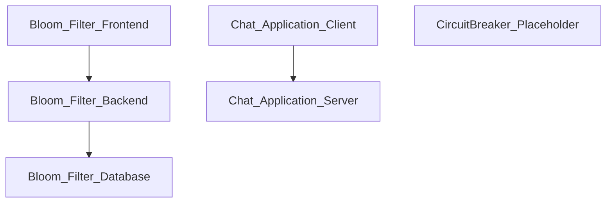

## Stack
- Monorepo of independent system-design demo projects; no root manifest (README.md is a one-line stub).
- Bloom Filter: React 18 + Vite frontend, Node.js/Express backend, PostgreSQL, Docker Compose.
- Web Socket/Chat Application: Node.js, Express 5, Socket.IO 4.
- CircuitBreaker: empty directory — no content observed.

## Directory map
| path | what lives there |
|---|---|
| `README.md` | one-line repo title, no content |
| `Bloom Filter/` | full-stack Bloom Filter simulator (README, docker-compose.yml) |
| `Bloom Filter/frontend/` | React/Vite app (`package.json`, `vite.config.js`, `nginx.conf`, `Dockerfile`) |
| `Bloom Filter/frontend/src/` | `App.jsx`, `App.css`, `main.jsx`, `components/`, `services/api.js` |
| `Bloom Filter/backend/` | Express API (`package.json`, `.env.example`, `Dockerfile`, `tests/`) |
| `Bloom Filter/backend/src/` | `index.js`, `config/db.js`, `bloomfilter/`, `routes/api.js` |
| `Web Socket/` | container folder for websocket demo(s) |
| `Web Socket/Chat Application/` | Socket.IO chat app (`package.json`, `app.js`, `readme`) |
| `Web Socket/Chat Application/public/` | `index.html`, `script.js`, `style.css` (client) |
| `CircuitBreaker/` | empty — no files found |

## Diagram

## Component index
- [[Bloom_Filter_Frontend]]
- [[Bloom_Filter_Backend]]
- [[Bloom_Filter_Database]]
- [[Chat_Application_Client]]
- [[Chat_Application_Server]]
- [[CircuitBreaker_Placeholder]]

## Entry points
- Bloom Filter frontend dev: `Bloom Filter/frontend/src/main.jsx` (via `vite`, script `dev` in `Bloom Filter/frontend/package.json`)
- Bloom Filter backend dev/prod: `Bloom Filter/backend/src/index.js` (scripts `start`/`dev` in `Bloom Filter/backend/package.json`)
- Chat Application: `Web Socket/Chat Application/app.js` (scripts `start`/`dev` in `Web Socket/Chat Application/package.json`), static client served from `Web Socket/Chat Application/public/`

## Conventions
- Bloom Filter backend: routes mounted under `/api` prefix (`app.use('/api', apiRoutes)` in `Bloom Filter/backend/src/index.js`); centralized 404 and error-handler middleware defined after routes.
- Bloom Filter backend: config split into `config/` (db), `bloomfilter/` (domain logic), `routes/` (HTTP layer) — observed in `Bloom Filter/backend/src` listing.
- Bloom Filter backend uses `dotenv` to load `.env` (`.env.example` present, real `.env` presumably gitignored per `Bloom Filter/backend/.gitignore`).
- Chat Application: single-file server (`app.js`) wires Socket.IO events (`connection`, `disconnect`, `message`, `feedback`) directly with no separate router module.
- Each subproject keeps its own `package-lock.json` (npm), no root lockfile.

## Where things go
- To add a Bloom Filter API endpoint: edit `Bloom Filter/backend/src/routes/api.js`, and hash/bit logic in `Bloom Filter/backend/src/bloomfilter/`.
- To add a Bloom Filter UI feature: edit `Bloom Filter/frontend/src/App.jsx` and add a component under `Bloom Filter/frontend/src/components/`, wire calls in `Bloom Filter/frontend/src/services/api.js`.
- To add a chat feature: edit server events in `Web Socket/Chat Application/app.js` and client in `Web Socket/Chat Application/public/script.js`.
- To implement CircuitBreaker: the directory is currently empty — create structure from scratch.
